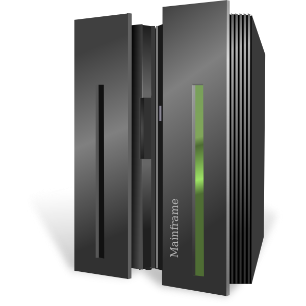
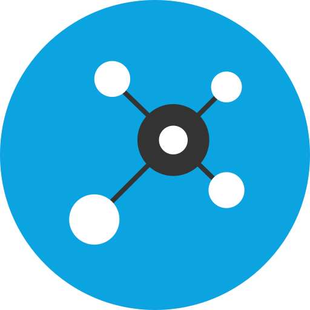

# Hi, I'm Layton, a [Mainframe COBOL Developer](https://www.linkedin.com/in/layton-d-george/) :computer:
##  Development Projects:
- **Mainframe**
	- [Mutual Fund Operations Dashboard](https://github.com/laytondg/project-template)
    - [Fund Account Reporting Perfomance Enhancements](https://github.com/laytondg/project-template)
    - [Alternative Investment Prodcut Modernization](https://github.com/laytondg/project-template)
    - [Trade Monitoring & Alerting](https://github.com/laytondg/project-template)
    - [Settlement Contract Cancellation Processing](https://github.com/laytondg/project-template)
    - [Failure to Settle Transaction Reversal](https://github.com/laytondg/project-template)
    - [Mortage Backed Security UI Rewrite](https://github.com/laytondg/project-template)
    - [Corporate Action Processing](https://github.com/laytondg/project-template)
    - [Trade Aggregation & Reporting](https://github.com/laytondg/project-template)

- **Other**
	- [Non Profit Organization Headless CMS](https://github.com/laytondg/project-template)
    - [Parking Space Reservation System](https://github.com/laytondg/project-template)
    - [Non Profit Organization Website](https://github.com/laytondg/project-template)
    - [Short Term Rental Calendar Sync](https://github.com/laytondg/project-template)
    - [Property Management Company Website](https://github.com/laytondg/project-template)

<h2>  Connect with me:</h2>

[][linkedin]

[][twitter]

[][instagram]

[linkedin]: https://linkedin.com/in/layton-d-george
[twitter]: https://twitter.com/LaytonGeorge
[instagram]: https://www.instagram.com/twinbrodarklg

